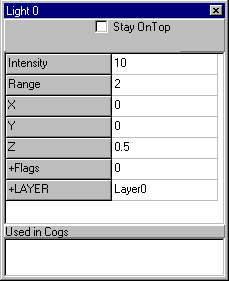

title: Lighting
ext: htm
body:

Author: 8t88

> Note: This editing technique does not cover colored lighting used in
> MotS.

Lighting... where should I start? How about at the **basics**?
First, lighting is an essential part of a JK level. Without it you
would wander aimlessly in the dark, and we all know what it's like
trying to find your way to the refrigerator late at night. :) One
thing people may not know about lights is that they are not part of
a normal JK level. Light information is only stored in a **.jed**
file. It is important to remember while editing that lighting is
**static**. Players cannot cast shadows. That is one reason JK runs
so well; **lighting is precalculated**. There are two kinds of
lighting covered in this technique: 1) - Light from positions and 2)

Light from sectors. We'll start with light from positions.
    
Light from positions comes from light objects (just referred to
as lights) and is your basic form of light. To add a light to a
level, switch to light mode by pressing "L" or the Light button,
place the cursor where you want to have the light, and press
"Insert". You may want to switch to a side view to make sure it's at
the right height. In the Light editor you will notice two important
sections: **Intensity** and **Range**.
    

      
## The Light editor.
    
**Intensity** - Intensity changes the brightness of the light. The
values for lights run from 0 to 1. Anything over 1 acts as 1, fully
lit. Because light intensity decreases with range, a light with a
value of 1 can give off a light value less than 1. So, values above
one are supported. Also, values below zero are supported (negative
light) to completely darken a room.

**Range** - Range determines the distance the light will be cast
until it fades completely away. Range is measured in JKUs. The
fading is quadratic, so the intensity at about half way is about
0.25 of the original intensity.  
    
Also, there is one, single flag for lights: Not blocked. As you
can probably guess, when this flag is checked, the light is not
blocked by walls or other objects.
    
Since lighting is only stored on vertices, it may be a good
idea to add lights with small ranges near vertices to specifically
light a corner. Also, JED light calculations may give strange
results when a light is placed directly on a surface. To avoid this,
just place the light really close to the surface but not on it.

The second kind of light is Light from sectors. This may sound a
little confusing, but you'll understand in a minute. Under the
Sector editor you will notice a section titled **Extra Light**. This
setting is like the intensity setting mentioned above but has no
range because the entire sector is lit with this setting. The Extra
Light setting is usually used for special effects in COGs.
    
  
      
## Sector editor with Extra Light Setting.
    
Now, let's calculate the lighting. There are two ways to
calculate lighting:

* Normal, which adds lights to the .jed file
* On visible layers, which will calculate lighting only on layers that are set to visible.

To access these, select Tools menu; they should be the first two.

Well, that just about wraps up the basics of lighting in JK.
Remember, this editing technique does not address colored lighting
used in MotS.

