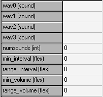

Author: EvanC

## Sector Sounds

Adding sounds to sectors can help set the mood of a level. Here is how
you do it.  
  
Select the sector that you want to add a sound to. Go to the item editor
and double click on the value 'sound'. JED will bring up a list of the
wav files that are used in JK. For this tutorial you can just select one
of theirs but in the future you may want to make your own. Anyways,
select one of them and you should hear it play. Double click on it and
it comes up in the item editor. What you need to do now is set the
volume of the sound. You can go up to a value of 1. I personally think
0.5 is loud enough but I have been told I have sensitive ears:-) You can
choose what you want. In JK when you enter your sound sector you will
hear the sound you chose playing at the volume you chose.  
  
## Ambient sounds

Using a cog from JK you
can make sounds that will randomly play in your level. This is good for
something like a spaceport when you want random engine sounds to play at
random times. The cog is called 'randomambient.cog' and is a regular JK
cog so there is no downloading nessacery. Add the cog to your placed
cogs and then you will have this:  
  

The first four values are the sound files(wav's) that the cog will
randomly play. Numsounds is the number of sounds(max four).
Min\_interval is the minimum wait that the cog will wait before it plays
the sounds. Range\_interval is the range of the wait(ie:if the
min\_interval is 3 and the rnage\_interval is 4 it will wait a maximum
of 7). I'm sure you can work out the others(hint-just the same as the
last two but for volume). Once you have that all set up like you want it
you can save your level and run JK.  
  
## Things to remember

Keep your sound volume from 0-1

If you make one sector with a loud sound in it and the one next to it
with no ound it will seem silly in JK. Spread your sounds out. If you
make a sector with sound volume 1 make sure that the one next to it has
a volume of about 0.9 so that it changes smoothly.

Don't make the sounds illogical. If you're going to be in an engine room
use an engine sound-not a wind sound.

