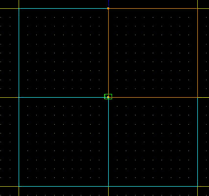
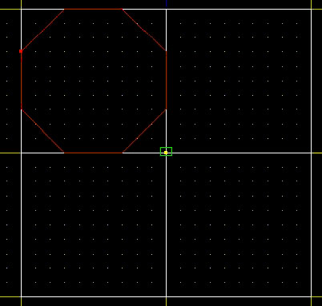
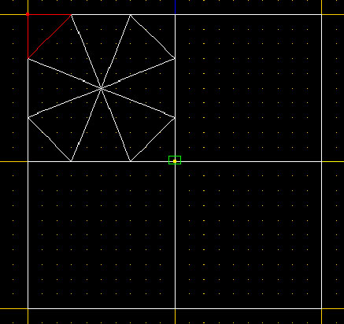
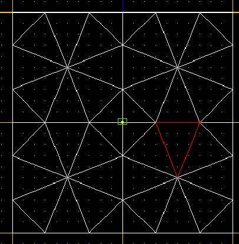
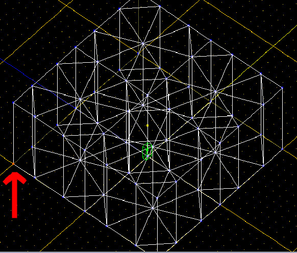
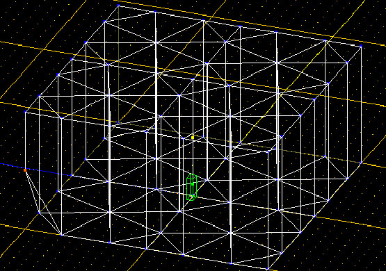
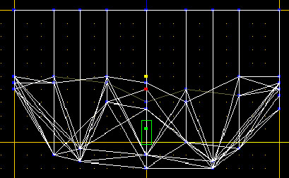
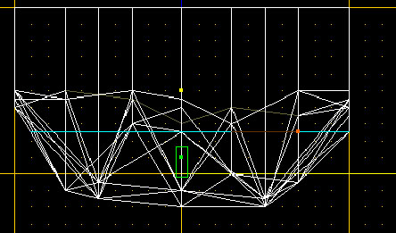
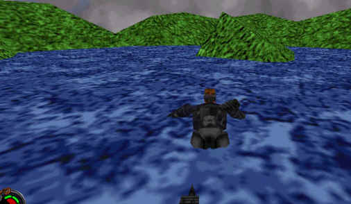

Author: Darth J

This tutorial is written for any editor that is familiar
with the cleave tool, and dragging vertices without getting non-convex
or non-planar surfaces.  This is a more advanced tutorial, so if you're
new to Jed, I recommend starting with something easier.  For this
tutorial, we will be making a very small area with small hills and a
pond.

## Step 1: CLEAVING

First, cleave the default sector into 4 equal sections:

Now, select 1 of the 4 sectors, and cleave the corners into separate
sectors

Now, connect each vertice of the octagonal sector to the center.

Make the remaining 3 sectors identical to the first one.

        In the above screenshot, you'll notice that all of the sectors
are triangular.  This prevents non-convex sectors and surfaces when
dragging the vertices.  If you're not a fan of cleaving, then you're in
luck, because that's pretty much all you'll need to do.

 

## Step 2: DRAGGING

            Now we move on to a more complicated stage.  You will have
to drag the bottom vertices UP, and only UP.  If you drag them side to
side, you will end up with a handful of errors.

 

            First, you will need to multi-select one bottom corner.  The
reason you multi-select the vertex is because there is actually more
than one in that exact same position, and you need to drag all of them.

Drag this corner to a length that pleases you, I recommend about halfway
to the top of the sector.

Repeat this step for every vertex along the outside of the level.  Be
sure to drag at random, otherwise it won't look like random terrain.

             Your level should now look similar to this.

Now to make the inner sections random, you may drag any of the remaining
vertices UP or DOWN only.  The inner section will be the area that will
make up our pond, so if you want some small islands, you should drag 2
or 3 vertices (that are linked) up about the same length as the outer
vertices.  I also recommend dragging the vertices down more as you get
closer to the center.

             Your level should now look similar this.

Congrats, we're done with the vertex dragging.  Now, texture your level
and move on to the next step.

## Step 3: WATER

            This is one of the easiest steps, but for some reason, a lot
of people don't understand it.  Multi-select EVERY sector, and then
cleave a straight, horizontal line right where you want the surface of
the water to be.

Now, multi-select the adjoins where the surface of the water is, and set
the GEO value to 4, rendering the adjoin visible.  Texture the surface
of the water with a water texture of your choice.

             Finally, select all of the sectors underneath the surface
line, and flag them as "underwater".  You have no made an error-free,
natural looking level.  Now, of course this doesn't look very good by
itself, but now you know the basics of natural terrain and natural
water.

