Author: Brian Lozier
  

This piece is intended to give beginners an overview of the cleave tool,
as well as provide some insight on its use for more advanced editors. So
far, JED is the only Jedi Knight level editor to have a cleave tool, so
if you do not have JED, this likely won't help much.

Please read through our [Basic Editing Section](/basics/). It will give
you an overview of what a sector is, all the different rules, and
basically get you familiar with JED. As always, if you have any problems
with this tutorial, or editing in general, please feel free to visit the
[Massassi Message Board](http://forums.massassi.net). The board is
frequently visited by editors of all skill levels, and if they know the
answer to your question, they will help you out.

The cleave tool can be implemented in any mode, but it doesn't make
sense to use unless you are in sector or surface mode (there are
advanced uses in other modes, some of which will be discussed later).

You may remember this diagram from [Basic Editing: Lesson
3](/basics/basic3.htm). Just click on whatever mode you like, then press
the \[c\] key to start the cleave tool.

##Surface Cleaving:
What does cleaving in surface mode do? Basically, it takes whatever
surface you are working on, and cuts it into two separate surfaces. The
two surfaces now share a common edge along the line you cleaved. The
cleave tool will only cleave STRAIGHT lines. If you want to cleave a
square surface out of another square surface, you must cleave multiple
times. Why is it like this?

The Jedi Knight engine doesn't like non-convex sectors or surfaces. By
forcing you to only use straight cleaves, JED basically makes sure you
cannot get non-convex surfaces. For more on convex vs. non-convex, see
the JED help file, and the [Basic Editing](/basics/basic.htm) section.

The easiest way to select a surface is to go to 3d preview and click on
it. Alternatively, you can click on the surface in the JED main window,
but often it takes a few clicks to get the correct surface selected.

One important thing to remember: Do NOT attempt to cleave unless the
grid is lined up with your current view. It *can* be done in certain
situations, but as a general rule, don't. It will never work if the grid
perpendicular to the screen. Meaning, if the grid appears as a perfect
line, rather than a plane, the cleave tool will not work.

So, this brings us to our first real world problem. If you have a
surface selected, how do you align the grid and the view to that surface
to make it easily cleavable? In most cases this is not a very difficult
task, but as your editing skills improve, it will sometimes become a
challenge. Basically, once you select the surface, you press \[shift+s\]
to align the grid to it. After that, you can use the asterisk (\*) key
on the number pad (only) to align the view to the grid. This is a good
function, but sometimes your view gets messed up.

An easier way is to use \[shift+1,2,3,4,5, or 6\]. What this does is
create an exact side or top view, as well as align the grid to the
current selected surface. Note that this will only work if your surface
lines up with a side or top view. If it doesn't, then this method won't
work for your situation. You will then have to use the \[shift+s\] and
\[\*\] key combinations to get a good view of your surface.

Let us demonstrate how to create a simple doorway (not a moving door,
simply the space that that door would occupy). We must first select a
wall surface. The easiest way to select a wall surface in this case is
to start a new project, go to 3d preview, and click on one of the walls.
Once selected, try pressing \[shift+2 or 3\] to get the grid aligned
perfectly.

From here, there are two ways to cleave a doorway. It really doesn't
matter to Jedi Knight, but from experience, I can tell you that shadows
look better on vertical cleaves (as opposed to horizontal ones). This
means that you want to make your longest cleaves vertical, and your
shortest cleaves horizontal. Of course, you can do it opposite if you
like, this is just practice.

So, we will make a doorway for a 2x3 door. The small doors you see in JK
are generally 2x3 doors. It is easiest to cleave dimensions with the
grid snapped to .1. Why? Well if you take a .1 grid setting, and you
want to cleave a 2x3 door, you can use the dots to count two over and 3
up, and the door will fit exactly. To set the grid settings, you must to
to your map settings window (under the Tools menu), and set the grid
size to .1. Once you do that, you will also want to set the grid snap to
.1. This allows you to cleave exactly on the dots. If you set it to .2,
you can only cleave every two dots, but if you set it to .05, you will
be able to cleave on each dot, as well as between each dot. Experiment
around with the grid snap later on to get used to the settings.

Once you have your snap and grid size set, your surface selected, and
the grid and view aligned, you are ready to begin cleaving. Pick a line
of dots to cleave along, and cleave it vertically all the way across the
surface. Make sure to go straight up and down, as a diagonal cleave will
not work for a door (which we will insert later). Once that is cleaved,
you can press the \[r\] key and rotate the mouse to see exactly what you
did. Once you are satisfied with it, select the surface you are going to
cleave next. It will be one of the surfaces you created after your
original cleave. Once it is selected, use \[shift+2 or 3\] to re-align
your grid and view.

Now, count over two dots and cleave vertically once again. The two dots
correspond with the 2 in the 2x3 elevator (meaning, two units wide).

Now is a good time to bring up some points about cleaving surfaces.
Firstly, you don't have to cleave across the whole surface. If you make
a small cleave line, then let go, JED will automatically cleave the rest
of the line for you (remember, lines are infinitely long). Second, if
you are cleaving, and accidentally start cleaving the wrong surface, you
can hit the \[Esc\] key to cancel the cleave. Note that this will only
work if your mouse button is still depressed. If you finish a bad cleave
(meaning you are done cleaving by the time you realize it), you can fix
it one of two ways.

  - Go to Edge mode, select the edge that you created with the cleave,
    and press the \[m\] key. This will merge the surfaces into one
    surface once again. Once you do that, you will also want to get rid
    of the extra vertices you left behind. Switch to vertex mode, select
    the extra vertex, and press \[Delete\]. Do this once again for the
    other vertex.
  - Use the Undo. It's under the Edit menu. Often this leaves you with
    invalid adjoin errors. These errors are no big deal, and have easy
    fixes. To see if you get this error, go to the Tools menu and select
    Consistency Check. If you get an invalid adjoin error, highlight it,
    then click the Go To button. Click back to your main JED window, and
    the bad adjoin will be selected. Press \[Alt+a\] to UNadjoin the
    surfaces. Then press the \[a\] key to re-adjoin them. Your error
    should now be gone. If you have more than one, follow that procedure
    to fix the remaining ones. Note that in our simple examples, you
    will probably not get this error, but later on you might run into
    it.

Now that we have the width of our door cleaved, it is time to cleave the
height. To do this, make sure the center surface is selected. Then,
re-align the grid and the view \[shift+2 or 3\]. Once that is done,
count 3 dots from the bottom and cleave it horizontally. You now have a
surface cleaved that is the perfect size for a door.

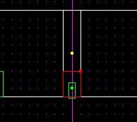 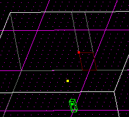

How do we make that surface into a doorway? Well that's pretty simple,
just select it, and press the \[x\] key. This will extrude another
sector, adjoined to the first, the exact shape of the surface you had
cleaved. If you want to have complete control over the length of this
new sector, there is a neat feature that allows you to do this. Instead
of just pressing \[x\] to extrude, use \[shift+x\]. You will be prompted
to insert a value, in JKU's, of the length you want. Note that 1 is the
length of one square, .1 is the distance between dots on the grid (if
you have the grid set at .1).

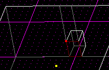

You can use this method to cleave the floor, thus allowing you to insert
an elevator, or the ceiling, for a skylight (or something). This is one
technique that all Jedi Knight level editors (using JED) must learn
well.

This technique can also be used to create some cool effects with
outdoor-type architecture. Check out the first [Outdoor
Buildings](/tutorials/outdoor/) tutorial. Notice how the sides and top
of the building are featureless. They are exactly square. Take a look at
any of the buildings around your area. Check out any of the buildings in
the Star Wars movies. There are *never* buildings so bland and
featureless as this.

How then, do you use surface cleaving to add features to your buildings?
Its pretty easy actually. Consider the tops of all the skyscrapers in
all the big name action movies. Notice how the tops never just end. They
always have a lip or edge protruding up so people don't fall off. Lips
like this are extremely easy to create. Just select the top surface of
the building, cleave a smaller square out of it, select the inside
square, and press \[shift+x\]. Use a value such as .05 or .1, and you
have a better rooftop.

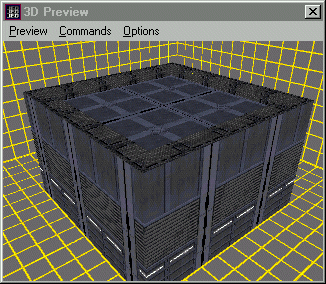

You can use techniques like this to add features to all kinds of
architecture. Say you have a big beam running on the top of a big
hallway. Why not make it into an I-beam? Take a look at the difference
this kind of detail can make.

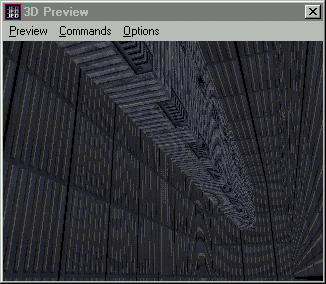 

##Sector Cleaving:
Sector cleaving is used to cleave sectors. Just go to sector mode (hit
\[s\] or use the icon at the top of the screen), and use the \[c\] key,
just like in surface cleaving. The difference here is that your cleave
will affect the whole sector rather than just one surface. Why would you
want to cleave a whole sector? There are TONS of reasons. Most
architecture is created this way, just take a look at the [Beams
Tutorial](/tutorials/beams/), the Outdoor Buildings Tutorial, the
[stairs tutorial](/tutorials/stairs_basic/), and basically anything else
that shows you how to make architecture.

Now that we know sector cleaving has many different uses, we will
discuss some of them. First off we are going to change the normal JED
default sector from a square into a rough octagon. This is easily done.
Start a new project, and you should be automatically dropped into sector
mode with the only sector selected. Double check this by making sure the
sector button at the top of your screen is depressed.

Now, hold down the \[r\] key and rotate the mouse around to get an idea
of how the sector is currently shaped. You can even use \[F12\] to use
the 3d preview and walk around inside the square. Once you are satisfied
with that, click back to the normal JED mode, and press \[shift+1\]
(this will put you back to the top view). Press \[c\] and cut diagonally
across one corner. After that, use the \[r\] button and rotate the map
around. You will see that you cleaved the sector into two separate
sectors.

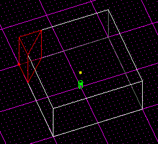

Another important thing to note about sector cleaving is this. Once you
cleave a sector, the two remaining sectors are adjoined along your
cleave. This means that in the game, the player won't know there are two
sectors there. Check the 3d preview. Other than a few texture
mis-alignments (maybe) there is no difference from before. The player
can move freely across the adjoin.

Back to surface mode again, there are some other things we can note
about this adjoin. You can actually select the surface that separates
the two sectors. Once that is done, you can press \[shif+f\]. This
selects the other side of the adjoin. You must understand that at each
adjoin, there are two separate surfaces. Each of the two sectors has a
surface, and \[shift+f\] allows you to switch between them.

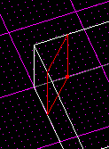 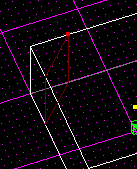

Notice that when you use \[shift+s\] the color of the selected surface
changes. This allows you to see which surface is facing you in the
closer sector, and which is facing away from you in the farther sector.

If you want, you can UN-adjoin the sectors by selecting the adjoined
surface (either one) and pressing \[alt+a\]. Now go to your 3d preview.
Since the sectors are no longer adjoined, you cannot walk across, nor
even see, the other sector. To readjoin, you merely need to press the
\[a\] key.

Back into sector mode, select the corner sector that you cleaved off.
Now press \[Delete\]. This will totally delete the sector. Since the
adjoining surface now has nothing else to adjoin to, it will default to
being solid again. You can see this by going back into the 3d preview.
It looks the same as it did when we unadjoined the sectors, but this
time there is simply no sector on the other side.

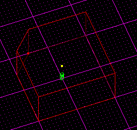

Now, with the remaining sector selected, cleave off the other 3 corners.
Select the corner sectors, and delete them. You will end up with an
octagonal sector. Feel free to browse around in 3d preview or by using
the \[r\] key.

It is very important to understand how sector cleaving works, as it is
used in a multitude of functions. If you want an elevator, you must
cleave the shaft out of a sector. If the elevator is passing from a
small shaft to a large room, the portion of the large room that the
elevator moves in must be the same sector. To demonstrate this, you can
take a look at the following picture. Notice that the selected sector is
the elevator shaft. It is adjoined with the two sectors that make up the
room.

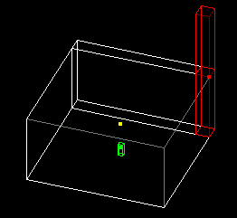

Now take a look at the room in 3d preview. Notice that you simply cannot
see all the different sectors that make up the room and elevator shaft.
It just looks like a big room with an elevator along one wall. This is
because all of the sectors are adjoined to each other, allowing the
player and other stuff to pass freely between them.

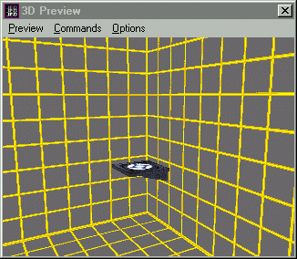

Note that the reason the elevator has to be one shaft is this: if any
3do passes between sectors, it often disappears and reappears. You
certainly don't want a disappearing elevator in your level.

What else is sector cleaving good for? As mentioned before, it is the
main tool you will use to create architecture. Remember to read the
related tutorials (anything having to do with architecture, listed in
our [tutorials section](/tutorials.shtml)) when you are done with this
one. This will give you a general overview of cleaving architecture, but
you will learn to create specific structures with advanced techniques by
reading the others.

Once again, we will start with the default sector in JED. Make sure you
are in sector mode, and cleave another square in the center. Notice that
it takes 4 cleaves, two longer ones, and two shorter ones. The reason
for this is that Jedi Knight will not allow non-convex sectors. You can
read more on this in the previous lessons. Take a look at it after its
been cleaved. The first is a top view, outlining the cleaves, and the
second is a rotated view, so you can see exactly what you have.

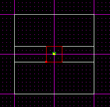 

Notice once again that if you go to 3d preview, you don't see all the
cleaves - that is once again because all the sectors are adjoined. I
cannot stress enough the importance of understanding this concept. Now,
select the center sector that we cleaved out, and press the \[Delete\]
key. If you look in 3d preview, you will notice that the sector we
deleted has turned into solid architecture in the center of this level.

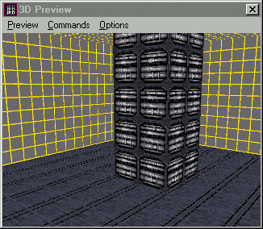

Briefly, the reason this happens is due to Jedi Knight and a concept
called Negative Space. You can read more about it in the basic editing
articles.

Basically anything you want to create can be done with sector cleaving,
again, take a look in our tutorials section for more on this. You are
only limited by your imagination.

##Efficient Cleaving:
Now we will discuss the impact of sector and surface cleaving on
framerate. Framerate is measured in Frames Per Second (FPS). Picture a
cartoon - it is animated by all the different cells of animation.
Framerate works much like this. People see on average about 25 frames
per second, so if you are getting over that, it is pretty much wasted.
It is important to remember that people have different systems. Some
people have great graphics cards and some don't. When you test your
level, it is important to check it in Software mode. This means you will
bypass your 3d card (if you have one). To do this, in game, press
\[esc\], then go to display, and uncheck the "enable 3d acceleration"
option. To see the actual framerate, in a single player game, press
\[t\] then type in "framerate." If you are in multi-player, press \[t\]
then \[Tab\] then "framerate." You will see a number at the top of your
screen. You really need to take a look at the lowest it goes, and in
software at the lowest resolution, try not to let it go down past about
15 frames per second.

Note that this is just a general guide. The best way to check is to play
the LEC levels and get an idea of what they get for framerate, and try
not to drop below that when making your own levels.

First off, one of the most damaging things you can do to the player
(framerate wise) is to force him/her to look through tons of adjoins.
Looking through one or two is fine, but looking through a bunch at a
time can really kill your framerate. This does NOT mean you can't have
tons of adjoins, it means to try to limit the number you are looking
THROUGH. So, if you have beams, you only look through one, then see a
wall. It doesn't make that much difference if you have tons of beams,
but if you have cleaved your beams wrong, you will be forced to look
THROUGH a bunch of them.

Note the picture below. This demonstrates good cleaving versus bad
cleaving. Notice that in the first picture, the player must look through
tons of visible adjoins, while in the second picture, they only look
through one before hitting a solid wall. The second is also a better way
to cleave due to lighting concerns. Its also easy to realize which way
is more efficient by counting the number of sectors. The first picture
consisists of 12 sectors, while the second consists of 20. This simple
example isn't enough to make a difference, but when you create large,
complex levels, the extra sectors will really make a difference.

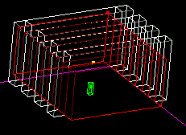 

The best way to find out if your framerate is acceptable is to get your
level beta-tested. Send it out to a lot of people (10 or so) before you
release, and get bug reports from them. If they say a certain area has
bad framerate, do something to fix it. This could be putting a wall in
the way of a wide open area (not a 3do, as those don't block anything
for the engine), finding another way to block the view, or rebuilding
the area. It's worth it, so don't skimp.

##Edge Cleaving:
Edge cleaving is not used very often, but in case you need to add
vertices (used for tweaking your lighting), you can use this method. Go
to edge mode, select an edge, and cleave it where ever you want. Notice
that when you go to vertex mode, your new vertex will show up. This is
pretty basic, and most of the time unnecessary, but you may run across
the need to do it.

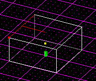 

That's pretty much all for now, as always, if you have any feedback,
feel free to drop me an email.
